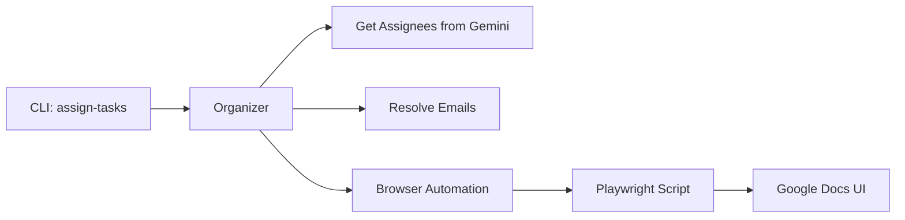

# Implementation Plan: Browser Automation for Task Assignment

## Overview

Implement browser automation using Playwright to assign tasks via Google Docs' native checkbox UI.

## Architecture



## Technology Choice: Playwright

**Why Playwright over Rod (Go)?**
- Better documentation and community
- More stable for complex web apps like Google Docs
- Playwright's TypeScript API is mature
- Can use persistent Chrome profile for auth

**Integration**: Go CLI executes Playwright script via `npx playwright`

---

## Proposed Changes

### Phase 1: Revert User Filter & Add Email Resolution

#### [MODIFY] [organizer.go](file:///Users/jflowers/Projects/github/jflowers/gcal-organizer/internal/organizer/organizer.go)
- Remove the "jay" filter from `processDocumentForTasks`
- Add method to get document attendees with emails

#### [NEW] [browser/](file:///Users/jflowers/Projects/github/jflowers/gcal-organizer/browser/)
- New package for Playwright-based browser automation
- Contains TypeScript Playwright script

---

### Phase 2: Playwright Setup

#### [NEW] [browser/package.json](file:///Users/jflowers/Projects/github/jflowers/gcal-organizer/browser/package.json)
```json
{
  "name": "gcal-task-assigner",
  "scripts": { "assign": "npx playwright test assign-tasks.spec.ts" }
}
```

#### [NEW] [browser/assign-tasks.ts](file:///Users/jflowers/Projects/github/jflowers/gcal-organizer/browser/assign-tasks.ts)
Playwright script that:
1. Opens Google Doc by ID
2. Scrolls to "Suggested next steps"
3. For each assignment (passed as JSON):
   - Locates checkbox by text
   - Clicks to open popup
   - Enters assignee email
   - Clicks "Assign as a task"

---

### Phase 3: CLI Integration

#### [MODIFY] [main.go](file:///Users/jflowers/Projects/github/jflowers/gcal-organizer/cmd/gcal-organizer/main.go)
- Add `assign-tasks` command
- Calls Gemini to get assignees (existing logic)
- Resolves names to emails (from doc attendees)
- Invokes Playwright script with assignment data

---

## Verification Plan

### Automated Tests
- Unit tests for email resolution logic
- Playwright test against a test document

### Manual Verification
1. Run `./gcal-organizer assign-tasks --doc <id> --dry-run` - verify output
2. Run `./gcal-organizer assign-tasks --doc <id>` - verify checkboxes show avatars
3. Confirm assignees receive task notifications

---

## Questions for User

1. **Chrome Profile**: Should we use `~/Library/Application Support/Google/Chrome/Default` for auth, or create a dedicated profile?
2. **Email Resolution**: Should we require attendee emails in the doc header, or use a separate lookup?
